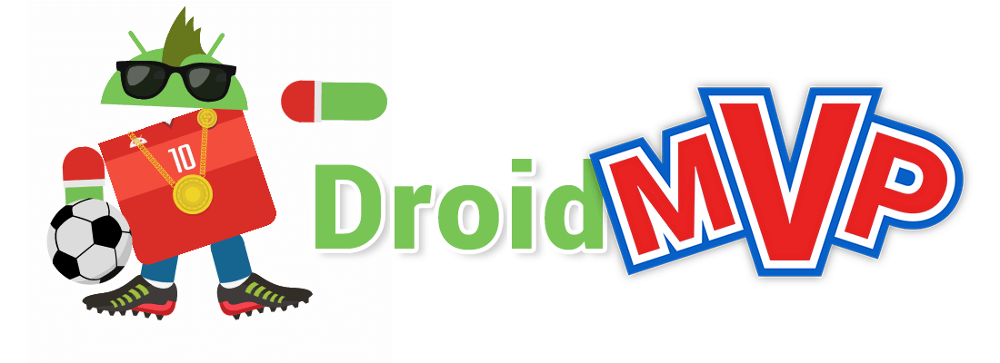

# DroidMVP

<p align="center">

</p>

[](https://jitpack.io/#andrzejchm/DroidMVP) [](https://android-arsenal.com/details/1/3776)
[](https://circleci.com/gh/andrzejchm/DroidMVP/tree/develop)

## About
DroidMVP is a small Android library to help you incorporate the [**MVP pattern**](http://antonioleiva.com/mvp-android/) along with [**Passive View**](http://martinfowler.com/eaaDev/PassiveScreen.html) and [**Presentation Model**](http://martinfowler.com/eaaDev/PresentationModel.html) (yes, those can be combined together :) ) within your Android project.

## Explanation 
<p align="center">

</p>
A short explanation of PassiveView, PresentationModel and how to use it with DroidMVP can be found [in this article](https://medium.com/@andrzejchm/presentation-model-and-passive-view-in-mvp-the-android-way-fdba56a35b1e)

## Setup

Add it in your root `build.gradle` at the end of repositories:
  ```groovy  
  allprojects {
    repositories {
        ...
        maven { url "https://jitpack.io" }
    }
  }
  ```
  

Add the dependency to your app's `build.gradle`
```groovy  
  dependencies {
    compile 'com.github.andrzejchm:DroidMVP:0.1.3'
  }
```

## Composition over inheritance
If by any chance you cannot extend from `DroidMVPActivity` or `DroidMVPFragment` you can always use the `DroidMVPViewDelegate`. Just make sure to bind it with your activity's or fragment's lifecycle the same way the `DroidMVPFragment` or `DroidMVPActivity` does it.

## Dependency Injection
This library makes it easy to use it with dependency injection frameworks like [Dagger](http://google.github.io/dagger/). To see how it could be done, check out the [**Sample project**](/sample-dagger), specifically the `BaseFragment` or `BaseActivity`

## Sample Project
A small android app which uses Dependency Injection along with **DroidMVP** can be found 
[**here**](/sample-dagger)

 Without dagger can be found [**here**](/sample).
 
 With `Parcelable` PresentationModel can be found [**here**](/sample-parcelable).

## Donation
If you think the library is awesome and want to buy me a beer, you can do so by sending some...
*  **ETH** here: `0xf7354a0F7B34A380f6d68a2661bE465C10D6AEd7`
*  **BTC** here: `12bU3BMibFqbBBymaftXTDnoHojFymD7a6`
*  **NEO** or **GAS** here: `AX1ovzRN2N28WJrtehjYXjwtHSvcqva6Ri`

